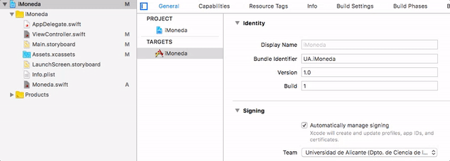

## Ejercicios de introducción a las aplicaciones iOS (1,5 puntos)

Desarrolla una *app* llamada `iMoneda` con la que se pueda "lanzar" una "moneda virtual" a ver si sale cara o cruz.

La interfaz de la *app* será muy sencilla y constará de:

- Un `Button` que al ser pulsado "lanzará" la moneda.
- Un `UIImageView` para mostrar la imagen de la cara o de la cruz
- Un `Label` para mostrar el resultado en modo texto ("cara" o "cruz")


1. La **vista** (0,5 puntos): Crea la interfaz arrastrando los componentes y colocándolos donde creas conveniente.
2. **Añádele al proyecto las imágenes** de la [cara](imag/cara.png) y de la [cruz](imag/cruz.png). Abre la "carpeta" `Assets.xcassets` y déjalas allí, en la lista de recursos, justo debajo del que pone `AppIcon` (NO en el icono de la carpeta *assets*). Verás que aparecen con un nombre que es el mismo del archivo pero sin la extensión. Podemos usar este nombre para referenciarlas en el código, luego veremos cómo.

    

2. El **modelo**(0,25 puntos): Crea:
    -  Un enumerado `Tirada` con los valores de `cara` y `cruz` que se pueda convertir a `String` 
    -  Una clase `Moneda` con un único método `lanzar()` que devuelva una `Tirada` al azar 
3. El **controlador** (0,75 puntos): 
    - Define en él una propiedad del tipo `Moneda`
    - Crea dos *outlet*, uno para acceder al componente `UIImageView` y otro para el `Label`
    - Crea un *action* que vincule el botón con algún método del `ViewController`
    - En el código del *action*:
        + Usa la propiedad del tipo `Moneda` del controlador para obtener una tirada
        + Muestra el resultado en modo texto en el `Label`, ("cara", "cruz")
        + Muestra la imagen apropiada

> Aclaración: Cómo trabajar con imágenes
> 
> Las imágenes se representan en iOS con objetos `UIImage`. Podemos obtener la imagen correspondiente a un recurso de los *assets* con su nombre:

```swift
let imagenCara = UIImage(named:"cara")
```

> El `UIImageView` es un componente de interfaz que contiene una `UIImage`. Podemos cambiar la imagen asignándola a la propiedad `image` del `UIImageView`.

```swift
let imagenCara = UIImage(named:"cara")
//SUPONIENDO que el outlet que representa al UIImageView es imageView
self.imageView.image = imagenCara
```


