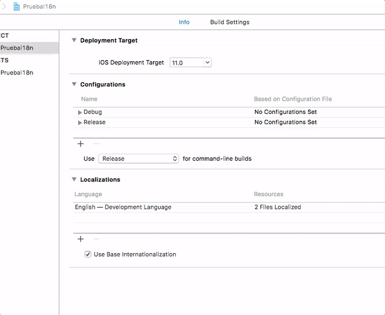
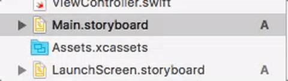
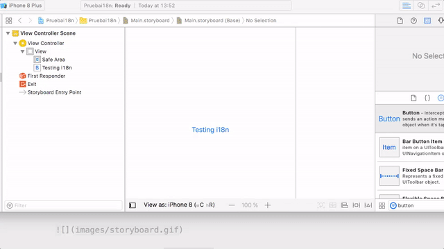

# Internacionalización de aplicaciones iOS

## Añadir soporte para i18n

En la versión actual de Xcode **los proyectos ya incluyen por defecto soporte para i18n**. Si en un proyecto Xcode seleccionamos el icono del proyecto en el *project navigator*, al final de las propiedades podemos comprobar que aparece marcada una casilla denominada `Use base internationalization`. Si el proyecto ha sido desarrollado con una versión antigua de Xcode, la marcaremos.

El idioma de desarrollo o *development language* es el que se va a usar por defecto para desarrollar la interfaz. Además de este podemos añadir otros idiomas. En la versión actual de Xcode solo está previsto el inglés como *development language* y no se puede cambiar desde el IDE. Podríamos cambiarlo [editando manualmente el archivo `.pbxproj`](https://www.ralfebert.de/snippets/ios/xcode-change-development-language/) del proyecto, aunque aquí vamos a usar el inglés como idioma base.

Podemos añadir idiomas a la *app* en la sección *Localizations*. Para añadir un idioma basta pulsar `+`



Fíjate en que cuando añadimos un idioma aparece un cuadro de diálogo que nos dice qué archivos de la interfaz se van a internacionalizar, lo habitual será seleccionarlos todos pero podemos escoger los que nos interesen. Además podemos elegir el método usado. Por defecto es `Localizable strings`, pero hay otro método llamado  `Interface builder storyboard`:

- `Localizable strings`: por cada idioma hay un archivo de texto `Strings` en el que se almacena la traducción de los textos de cada botón, label, etc. El *storyboard* es único para todos los idiomas, y lo que se hace es cambiar solamente el texto.
- `Interface builder storyboard`: tenemos una copia del *storyboard* por cada idioma, y la editamos por separado.

Aquí vamos a describir cómo usar los `Localizable strings`, ya que es el método más común.

## Localizar la interfaz gráfica

Al diseñar la interfaz hay que recordar que debemos usar el *development language* en los textos de los componentes. Por tanto por defecto pondremos los textos de los botones, `Label`, etc en **inglés**.

### Los archivos `.strings`

Supongamos que ya hemos terminado de desarrollar la interfaz y queremos traducirla. Si hemos añadido idiomas adicionales veremos que en el *project navigator* los iconos de *storyboard* aparecen con una flecha a la izquierda indicando que en realidad son varios archivos. Al desplegarlo veremos que es el *storyboard* en sí más un archivo `.strings` por cada idioma añadido.



Al abrir este archivo `.strings` veremos que es un archivo de texto en el que por cada componente de usuario que contenga texto hay una línea en el formato

```swift
"identificador-del-componente" = "Texto mostrado" 
```

Lo único que tenemos que hacer es *cambiar el texto al idioma correspondiente*. El identificador del componente es un tanto críptico ya que es autogenerado por Xcode,y se corresponde con el `Object Id` que podemos ver en el `Identity inspector`, aunque casi siempre es fácil saber de qué componente se trata simplemente por el texto mostrado.

### Probar la interfaz

Podemos previsualizar cómo quedará la interfaz en los distintos idiomas sin necesidad de ejecutar la *app*. En el *assistant editor*, clicamos en la barra superior del editor,  seleccionamos `Preview`, y el *storyboard* que queremos ver. Se mostrará el *storyboard* en el idioma base. Este idioma aparecerá en la esquina inferior derecha, pulsando sobre él podemos cambiarlo.



También podemos probar la *app* en el simulador y cambiar aquí el idioma del sistema. Habrá que salir de la *app*, ir al icono de *settings* (o *configuración* en la versión en español) y en el apartado `General` cambiar el `Language & Region`. El proceso es un poco más tedioso que la simple previsualización porque hay que salir y volver a entrar en la *app* y además el simulador tarda unos segundos en aplicar el nuevo idioma.

## Localizar los mensajes en el código