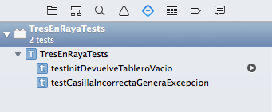

# *Testing* en Xcode

XCode incluye desde la versión 5 un *framework* de *testing* llamado `XCTest`. En el asistente de creación de un proyecto, cuando elegimos el nombre del proyecto podemos marcar los correspondientes *checkbox* para crear los *tests* asociados al proyecto. Como veremos luego con más detalle tenemos dos tipos genéricos de tests: las pruebas unitarias (*unit tests*) y las pruebas de interfaz de usuario (*ui tests*).


Si tenemos un proyecto ya creado sin *test*, podemos crearlos a posteriori con `File > New > Target > iOS unit test bundle` (o `iOS UI test bundle`).

## El navegador de Tests

Para moverse por los tests, lo más sencillo es usar el *Test Navigator*, que aparece en el área de Navegadores, a la izquierda de la pantalla. Su icono es el quinto por la izquierda, un rombo . En este navegador podemos ver todos los tests, ir al fuente clicando sobre el nombre del test y ejecutarlos pulsando sobre el pequeño botón de “play” que aparece a la derecha cuando pasamos el ratón por encima.



## Pruebas unitarias

En `XCTest` hay varios tipos distintos de pruebas unitarias:

- **Tests de “lógica”**: lo que todo el mundo entiende habitualmente por pruebas unitarias, es decir pruebas en las que comprobamos si determinado método funciona o no correctamente.
- **Tests de tiempo de respuesta**: en los que podemos ver estadísticas del tiempo que tarda en ejecutarse determinado bloque de código. Podemos fijar un *baseline* de tiempo de modo que el test se considerará que no pasa si está por encima del *baseline*
- **Tests asíncronos**: con código asíncrono podemos tener el problema de que Xcode no sepa cuándo ha acabado de ejecutarse nuestro código y por tanto se puede dar por acabado el test. Por ejemplo si lanzamos una petición HTTP no podemos hacer las comprobaciones hasta que no llegue la respuesta. En este tipo de test podemos indicar a Xcode cuándo lo puede dar por terminado, o en caso de sobrepasar un *timeout* que lo de por fallido.

### Un ejemplo

`XCTest` es muy similar a otros *frameworks* de pruebas unitarias como `JUnit`, así que es sencillo de usar para alguien que ya haya usado este último

Por ejemplo, supongamos que tenemos un juego de tres en raya y aquí tenemos parte del modelo (se omite el código interno de los métodos, para mayor brevedad)

```swift
enum Casilla {
    case vacia, X, O
}

enum ErrorJuego : Error {
    case casillaNoExiste
}

class Juego {
    var tablero : [[Casilla]]
    
    func getCasilla(fila: Int, col: Int) throws -> Casilla {
        ...
    }
    
    func setCasilla(fila: Int, col: Int, valor: Casilla) throws {
        ...
    }
    
    init(filas:Int, cols: Int) {
        ...
    }   
}
```

¿Cómo estar razonablemente seguros de que el código de los métodos es correcto?. Podemos comprobar varias cosas, por ejemplo

- Que cuando se inicializa el tablero todas las casillas están vacías
- Que las casillas se pueden obtener/fijar correctamente a un valor dado
- Que cuando se intenta obtener/fijar una casilla que no existe se produce un error

Vamos a ver cómo podemos automatizar todas estas comprobaciones en una *suite* de pruebas.

### Estructura de una *suite* de pruebas

Podemos ver la estructura que tiene un conjunto o *suite* de pruebas en la plantilla de *tests* que crea Xcode. En el caso de nuestro ejemplo podría ser algo como lo siguiente (suponiendo que el proyecto se llama `TresEnRaya`)

```swift
import XCTest
@testable import TresEnRaya

class TresEnRayaTests: XCTestCase {
    
    override func setUp() {
        super.setUp()
        // Put setup code here. This method is called before the invocation of each test method in the class.
    }
    
    override func tearDown() {
        // Put teardown code here. This method is called after the invocation of each test method in the class.
        super.tearDown()
    }
```

donde hay que destacar:

- El `import XCTest` incluye las librerías de *testing*
- Con el `import TresEnRaya` evidentemente importamos el código del proyecto. El `@testable` de delante cambia implícitamente los modificadores de acceso de las propiedades de las clases del módulo, para que sean accesibles a los *test*
- La clase que contiene la *suite* debe heredar de `XCTestCase`
- Al igual que en *frameworks* de *testing* como JUnit hay un `setUp()` y `tearDown` que se ejecutan al inicio y al final de cada *test*, respectivamente. En el primero podemos colocar código que inicialice los valores necesarios antes de cada *test* y en el segundo "limpiar" lo que haya hecho el test si es necesario.
- Las pruebas unitarias se deben implementar en métodos que no devuelvan nada y cuyo nombre debe comenzar por `test`. 
    

### Aserciones

Las aserciones son las cosas que queremos comprobar que son ciertas. Si lo son, entonces el código debe estar funcionando correctamente (al menos en el aspecto que estamos comprobando). Para hacer una aserción se usa la familia de métodos `XCTAssert`. Decimos familia porque podemos hacer diferentes tipos de comprobaciones, por ejemplo:

-  **Comprobar que algo es cierto** con `XCTAssert` o `XCTAssertTrue`: por ejemplo comprobar que justo tras inicializar el tres en raya, la posición (0,0) del tablero contiene la casilla vacía.
-  **Comprobar que algo es falso** con `XCTAssertFalse`. Una alternativa a la comprobación que decíamos antes sería comprobar que no es una X ni tampoco una O.
-  **Comprobar que algo es igual a algo** con `XCTAssertEqual`, por ejemplo que tras fijar una casilla a un valor al obtener la casilla obtenemos ese valor. 
-  **Comprobar que una operación genera un error** con `XCTAssertThrowsError`: por ejemplo si inicializamos un tablero de 3x3 y luego intentamos acceder a la casilla (5,5).

Esto son algunas variantes de `XCTAssert` aplicables a nuestro ejemplo, pero hay bastantes más (comprobar que algo es menor, mayor que algo, o que una operación no lanza un error, o que algo es `nil`,...).

En todas las aserciones podemos poner como parámetro final un mensaje (Un `String`) que aparecerá si falla el test

```swift
XCTAssertTrue(false, "Esta prueba va a fallar seguro");
```

Para más detalles sobre los distintos tipos de aserciones se recomienda consultar el apartado "Test Assertions" de la documentación de [`XCTest`](https://developer.apple.com/documentation/xctest)

### Ejecutar las pruebas y ver el resultado

En el *Test navigator* podemos pulsar el pequeño botón de “play” que aparece al pasar el ratón por encima de cada test, para ejecutarlo individualmente o bien el que aparece en la *suite* completa para ejecutar todas sus pruebas.

Se pondrá en marcha el simulador de iOS con la aplicación, ejecutará las pruebas y terminará. En el *test navigator* y en el código fuente de la *suite* aparecerá un icono al lado de cada test indicando si ha pasado o no. Si no ha pasado aparecerá además un mensaje en el fuente indicándolo. También podemos ver los mensajes de error en el *Report Navigator*.