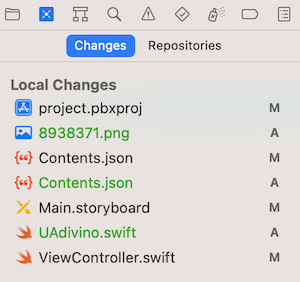
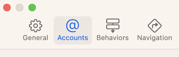
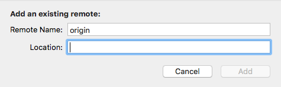
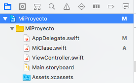

# Control de versiones con Xcode

## Crear un repositorio local para el proyecto

En este apartado veremos cómo trabajar con un **repositorio git local**. Tenemos dos opciones: crear el repositorio git local al crear el proyecto o añadirlo con posterioridad.

Para **crear el repositorio git local al crear el proyecto**: en la última pantalla del asistente (la misma donde se selecciona en qué carpeta guardar físicamente el proyecto) veremos una casilla de verificación que podemos marcar para crear un repositorio Git local (`Create Git repository on my Mac`)

Para **crear el repositorio git local una vez creado el proyecto**: en cualquier momento, vamos al menú de `Source Control`, opción `Create git repositories...`. Nos pedirá que marquemos para qué proyectos de los que tenemos abiertos queremos crear un repositorio git.

En los dos casos **Xcode hará automáticamente un *commit* inicial** del proyecto con el mensaje "initial commit" (recordad que cuando Xcode crea un proyecto iOS no está vacío sino que tiene algunos archivos, dependiendo de la plantilla elegida).

Podemos ver más información sobre el repositorio git y el estado actual de los ficheros con respecto al repositorio con el `Source Control Navigator`, que es el segundo icono del panel de la izquierda de Xcode.

## Trabajar con un repositorio remoto

Usaremos github en los ejemplos ya que es el servidor que empleamos en el curso, pero las instrucciones son prácticamente iguales para otros proveedores como Bitbucket o Gitlab.

### Configurar la cuenta de nuestro proveedor

Lo más cómodo es guardar primero los datos de nuestra cuenta en Github, para no tener que introducirlos cada vez que hagamos una operación con el repositorio remoto. Para ello nos vamos a las prerencias de Xcode (Menú `Xcode` > `Preferences...`, o bien pulsar la tecla `Command-,` - cmd y una coma) y en la barra de herramientas seleccionamos la opción `Accounts`

Desde esta opción podemos gestionar nuestra cuenta de desarrollador de Apple y también cuentas de terceros como Github, Bitbucket, etc. 

En la esquina inferior izquierda pulsamos sobre el `+` para añadir una cuenta y seleccionamos el tipo (en nuestro caso "Github"). Xcode nos pedirá que introduzcamos el usuario de Github y un *personal access token*, que sustituye a la contraseña de Github para autentificarse a través del API (Xcode usa el API de Github para interactuar con los repositorios)

> Desde hace algún tiempo la contraseña de github solo se puede usar para autentificarse en el sitio web, pero no para el API de Github , lo que incluye el uso de la herramienta `git` directamente o a través de un IDE. En su lugar hay que usar un *token* que [se puede generar](https://docs.github.com/en/free-pro-team@latest/github/authenticating-to-github/creating-a-personal-access-token) desde la página de Github.

### Vincular con el repositorio remoto

#### Repositorio remoto ya creado

Si ya hemos creado el repositorio git remoto, solo necesitamos saber su URL. 

En Xcode:

1. Vamos al `Source Control Navigator`, (segundo icono del panel de la izquierda de Xcode), 
2. De las dos opciones que hay, `changes` y `repositories` selecciona esta última
3. Verás una especie de árbol con los datos del repositorio local, las ramas, commits, tags...., el último nodo representa los repositorios remotos asociados. Pulsa con el botón derecho del ratón y en el menú contextual seleccionamos `Add Existing Remote...`

En el cuadro de diálogo que aparecerá colocamos la URL del repositorio remoto en el campo `Location`

#### Crear el repositorio remoto desde Xcode

Es muy parecido a lo anterior:

1. Vamos al `Source Control Navigator`, (segundo icono del panel de la izquierda de Xcode), 
2. De las dos opciones que hay, `changes` y `repositories` selecciona esta última
3. Verás una especie de árbol con los datos del repositorio local, las ramas, commits, tags...., el último nodo representa los repositorios remotos asociados. Pulsa con el botón derecho del ratón y en el menú contextual seleccionamos `New <Nombre_de_tu_proyecto> Remote...`

Xcode hará un *push* automáticamente tras crear el repositorio remoto

## Trabajar con el control de versiones

Cuando el proyecto actual esté bajo el control de versiones verás que en el `Project Navigator` del panel de la izquierda (el modo por defecto de ver los archivos del proyecto) los archivos que se han añadido desde el último *commit* tienen una `A` a la derecha y los modificados una `M`.

> Ten en cuenta que tras crear el proyecto, si has creado el repositorio local, Xcode hace automáticamente un *commit* inicial y por eso ningún archivo aparece inicialmente marcado con una `A`, solo lo verás cuando crees archivos nuevos o modifiques los de la plantilla.

Las operaciones a realizar con el control de versiones están localizadas en el menú principal de Xcode, en la opción `Source Control`. Las operaciones más habituales son:

- `commit`: aparecerá un cuadro de diálogo (bastante grande) con todos los archivos que han cambiado desde el último commit. Por defecto aparecerán seleccionados todos pero puedes seleccionar solo los que te interesen. En la parte inferior del cuadro de diálogo tendrás que escribir el mensaje asociado al *commit*.
- `push`: aparecerá un pequeño cuadro de diálogo en el que puedes elegir el repositorio remoto al que subir los cambios. Normalmente solo tendremos un remoto vinculado, de modo que bastará con pulsar sobre `Push`
- `pull`: igual a lo anterior pero será para traerse los cambios desde el repositorio remoto.
- `Discard all changes`: volverá a la versión local que teníamos en el último *commit*.
 