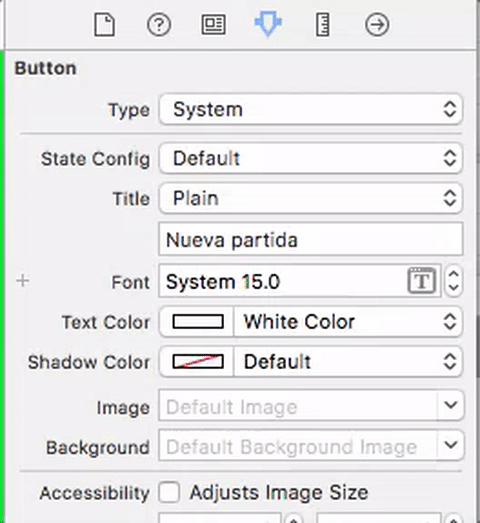

# MiniProyecto de iOS (6 puntos en total)
# Juego de las siete y media 

Se propone implementar el conocido juego de cartas de "[las 7 y media](https://es.wikipedia.org/wiki/Siete_y_media)". 

Para simplificar, solo habrá dos jugadores: el usuario contra la máquina que hace de banca. El usuario va pidiendo cartas una a una hasta que se pasa de 7 y medio o decide plantarse. La máquina no va sacando cartas una a una sino que obtiene una puntuación generada al azar.

Para crear el proyecto, como siempre hacemos, elige la plantilla de `App`. En la segunda pantalla del asistente dale como nombre `SieteyMedia` y asegúrate que en el interface pone `Storyboard` (como todas las apps que hemos hecho hasta ahora lo usan ya debería salir por defecto).

## Estructura de clases del modelo (2 puntos)

Necesitáis implementar primero **el enum `Palo` y las clases `Carta` y `Mano`**. Estos [se proponían como ejercicio](../s1/ejercicios.md) el primer día de clase, aunque es posible que no os haya dado tiempo a hacerlos, podéis hacerlos ahora. 

Además hay que añadir dos clases necesarias para poder jugar: la `Baraja` y el propio `Juego`

## Clase `Baraja`

Todas las cartas de la baraja. Del 1 al 12 de los cuatro palos, menos 8 y 9

- Propiedades: `cartas`, un array de `Carta`
- Métodos:
    + El `init()` debe rellenar el array de cartas con todas las cartas de la baraja. Podéis ir generando todos los números de todos los palos con un bucle doble de este estilo:
    
    ```swift
    for palo in [Palo.bastos, Palo.espadas, Palo.copas, Palo.oros] {
        for valor in 1...12 {
            if valor != 8 && valor != 9 {  //El 8 y el 9 no se suelen usar
                //Aquí crearíais la nueva carta y la añadiríais al array "cartas"
            }
        }
    }
    ```
    
    + `repartirCarta()`: devuelve la última carta de la baraja y la elimina de ella. Es lo que hace exactamente el método de la clase Array [`popLast()`](https://developer.apple.com/reference/swift/array/1539777-poplast), devolver el último valor de un array y eliminarlo de él. 
    + `barajar()`: debe cambiar al azar el orden de las cartas en el `Array`. Esto lo hace directamente el método `shuffle()` del `Array`.

### Clase `Juego`

Es la clase que implementa las reglas del juego de las siete y media. Os dejo aquí una implementación que podéis usar para no gastar demasiado tiempo haciendo la vuestra propia desde cero. No obstante no está completa, tenéis que implementar el método `acabarPartida()`.

Para simplificar el juego, en esta implementación la máquina no saca cartas de verdad, una a una. Se genera una puntuación al azar entre 1 y 7.5 y se informa al usuario de la puntuación que ha sacado. Para que el juego así tenga sentido, primero juega el jugador humano y luego la máquina.


```swift
//Esto de momento no se usa, pero luego sí, ya que necesitaremos notificaciones
import Foundation


enum EstadoJuego {
    case turnoJugador, ganaJugador, pierdeJugador, empate, noIniciado
}

//Versión simplificada de las 7 y media en la que la máquina no saca cartas una a una
//sino que simula la jugada generando un valor al azar entre 1 y 7.5 (no se pasa nunca!)
class Juego {
    var baraja : Baraja!
    var manoJugador : Mano!
    var estado : EstadoJuego
    var jugadaMaquina : Double = 0.0
    
    init() {
        self.estado = EstadoJuego.noIniciado
    }
    
    //LLamar a este método cuando se pulse el botón de "comenzar partida"
    func comenzarPartida() {
        self.baraja = Baraja()
        self.baraja.barajar()
        
        self.manoJugador = Mano()
        //generamos un valor al azar entre 1 y 7.5. La máquina nunca se pasa
        //primero generamos un valor entre 1 y 7
        jugadaMaquina = Double(Int.random(in: 1...7))
        //y luego el 50% de las veces le sumamos 0.5
        if (Bool.random()) {
            jugadaMaquina += 0.5
        }
    }
    
    //LLamar a este método cuando se pulse el botón de "Pedir carta"
    func jugadorPideCarta() {
        if let pedida = self.baraja.repartirCarta() {
            print("Sacas \(pedida.descripcion())")
            self.manoJugador.addCarta(pedida)
            let valorMano = self.sumarManoJugador()
            print("Llevas \(valorMano) puntos")
            if (valorMano>7.5) {
                acabarPartida()
            }
        }
    }
    
    //LLamar a este método cuando se pulse el botón de "Plantarse"
    func jugadorSePlanta() {
        acabarPartida()
    }
    
    
    //Métodos para uso interno de la clase, no es necesario llamarlos desde fuera
    //Calcula quién gana, cambia el estado del juego y lo muestra en la consola con print
    private func acabarPartida() {
        //TODO: sumar el valor de las cartas del jugador
        //TODO: calcular quién gana, en función de esta suma y la jugada de la máquina
        //TODO: cambiar el estado del juego al valor apropiado e imprimir un mensaje 
        
        //TODO: en la interfaz completa, enviar notificación al ViewController indicando que la partida ha terminado,
        //TODO: para que este habilite/deshabilite botones y muestre con un "alert" el resultado
    }
    
}
```

## Interfaz simplificada (1 punto)

El `ViewController` contendrá una instancia de la clase `Juego`.

> Es normal que el `ViewController` tenga referencia del modelo. Pero no es aconsejable que también pase al revés. En el modelo no se debería guardar ninguna referencia al *controller*, para poder reutilizarlo independientemente de la interfaz gráfica. El *controller* puede enterarse de que ha pasado algo "interesante" (por ejemplo que se acaba el juego) a través de notificaciones.

En esta versión muy simplificada de la interfaz solo aparecen en pantalla tres botones: "pedir carta", "plantarse" y "nueva partida", pero no se ven las cartas gráficamente. Eso sí, el juego debería funcionar correctamente, imprimiendo los mensajes con `print`.

## Interfaz completa (1.5 puntos)

En la interfaz completa deberían aparecer pintadas las cartas en pantalla conforme se van repartiendo. Además los botones se deberían habilitar/deshabilitar adecuadamente (por ejemplo si la partida se ha terminado no se puede pedir carta).

### Añadir las imágenes de las cartas al proyecto

Descomprime el .zip de Moodle con las imágenes de las cartas en png, selecciona todos los archivos y "déjalos caer" dentro de la carpeta de recursos (`Assets.xcassets`). 

Por cada imagen en png creará un *image set* con el nombre del archivo ( al estilo `1oros`, `3copas`, ...). Por desgracia solo disponemos de las imágenes de las cartas en baja resolución (@1x).

### Cómo dibujar las cartas

Cada vez que dibujemos en pantalla una carta estamos añadiendo a la pantalla actual un `UIImageView`. Tenemos que guardar referencias a todas las imágenes añadidas para poder borrarlas cuando acabe la partida. Definiremos esta propiedad en el *view controller* para guardarlas

```swift
//propiedad de ViewController.swift
var vistasCartas : [UIImageView] = [] 
```

En lugar de dibujar las cartas directamente en su posición final, podemos hacerlo fuera de la pantalla (es decir, con el origen del *frame* en coordenadas negativas) y luego hacer una animación hasta su posición definitiva. La siguiente función `dibujarCarta(carta: Carta, posicion : Int)` dibuja una carta con el efecto descrito. La `posicion` es el orden de la carta, para que se vayan colocando una al lado de la otra: 1, 2...

> En el código de ejemplo usamos un tamaño de carta fijo de 70x100 puntos, en el apartado siguiente se te propone adaptarlo al tamaño real de la pantalla. Nótese que hablamos de puntos y no de pixeles ya que en código no se usa la resolución física sino una resolución "lógica". Hay dispositivos que tienen distinta resolución física pero usan la misma resolución lógica, lo que simplifica el desarrollo. Podéis ver una tabla con resoluciones físicas y lógicas de distintos dispositivos iOS en [http://iosres.com](http://iosres.com) 
> IMPORTANTE: para que la segunda línea de este código funcione tu tipo enumerado `Palo` debe tener un valor "interno" de tipo `String`. Esto lo puedes conseguir simplemente poniendo `enum Palo : String ` en la definición del tipo.

```swift
func dibujarCarta(carta: Carta, posicion : Int) {
    let nombreImagen = String(carta.valor)+String(carta.palo.rawValue)
    //creamos un objeto imagen
    let imagenCarta = UIImage(named: nombreImagen)
    //para que la imagen sea un componente más del UI,
    //la encapsulamos en un UIImageView
    let cartaView = UIImageView(image: imagenCarta)
    //Inicialmente la colocamos fuera de la pantalla y más grande
    //para que parezca más cercana
    //"frame" son los límites de la vista, definen pos y tamaño
    cartaView.frame = CGRect(x: -200, y: -200, width: 200, height: 300)
    //La rotamos, para que al "repartirla" haga un efecto de giro
    cartaView.transform = CGAffineTransform(rotationAngle: CGFloat(Double.pi));
    //La añadimos a la vista principal, si no no sería visible
    self.view.addSubview(cartaView)
    //guardamos la vista en el array, para luego poder eliminarla
    self.vistasCartas.append(cartaView)
    //Animación de repartir carta
    UIView.animate(withDuration: 0.5){
        //"efecto caida": la llevamos a la posición final
        cartaView.frame = CGRect(x:50+70*(posicion-1), y:100, width:70, height:100);
        //0 como ángulo "destino", para que rote mientras "cae"
        cartaView.transform = CGAffineTransform(rotationAngle:0);
    }
}
```

### Eliminar las cartas de la pantalla

Una vez ha terminado la partida, o justo cuando comienza la siguiente, hay que borrar todas las cartas de la pantalla. Vamos recorriendo el array `self.vistasCartas` del *view controller* y vamos eliminando las cartas de la pantalla:

```swift
//Quitamos las cartas de la pantalla
for vistaCarta in self.vistasCartas {
    vistaCarta.removeFromSuperview()
}
//ya no tenemos imágenes de cartas en pantalla, ponemos el array a vacío
self.vistasCartas=[]
```

### Adaptar los dibujos a la resolución de la pantalla (0.5 puntos ADICIONALES)

OPCIONALMENTE, en lugar de dibujar las cartas con un tamaño y unas posiciones "fijas", puedes usar un porcentaje o fracción del ancho y alto total de la pantalla. Puedes obtener el ancho y alto de la pantalla del siguiente modo:

```swift
let limitesPantalla = UIScreen.main.bounds
let anchoPantalla = limitesPantalla.width
let altoPantalla = limitesPantalla.height
```

### Cómo manipular los botones

- Podéis habilitar/deshabilitar los botones por código poniendo su propiedad `isEnabled` a `true` o `false` respectivamente.
- Para que un botón aparezca inicialmente deshabilitado, en el "attributes inspector" de la parte derecha de Xcode desmarcar la casilla `enabled` dentro de `state` (está a mitad de panel)
- Para que se vea gráficamente que un botón está deshabilitado podéis ponerle un color distinto según el estado. Teniendo seleccionado el botón, en el `Attributes inspector` de la parte derecha de la pantalla, seleccionar el estado que nos interese en el desplegable. Al elegir colores (*text*, *shadow*, ...) serán los fijados para ese estado. 



Un problema es cómo enterarnos en el ViewController de que la partida ha acabado para habilitar y deshabilitar los correspondientes botones, y para mostrar el resultado con un cuadro de diálogo. Podemos hacerlo con notificaciones:

- Añadir código Swift a la función `acabarPartida()` de la clase `Juego` para que se envíe una notificación con el nombre y contenido que queráis (como contenido debería tener como mínimo una frase resumiendo el resultado del juego para que podáis mostrarlo).
- Añadir código Swift al `ViewController` para que si se recibe la notificación se ejecute un método de éste que habilite/deshabilite botones y muestre el resultado

### Cómo mostrar mensajes al usuario

Podéis mostrar el resultado del juego ("has ganado", "te has pasado",...) con un `UIAlertController`, que hará aparecer el típico cuadro de diálogo modal. El siguiente código muestra un cuadro que pone "¡¡Has perdido!!", con el título "Fin del juego", y con un único botón de "OK" que no hace nada especial, más que quitar el cuadro de diálogo. 

```swift
let alert = UIAlertController(
    title: "Fin del juego",
    message: "¡¡Has perdido!!",
    preferredStyle: UIAlertControllerStyle.alert)
let action = UIAlertAction(
    title: "OK",
    style: UIAlertActionStyle.default)
alert.addAction(action)
self.present(alert, animated: true, completion: nil)
```

## i18n (1.5 puntos)

Internacionaliza la aplicación para que esté localizada al menos en dos idiomas, los que tú prefieras