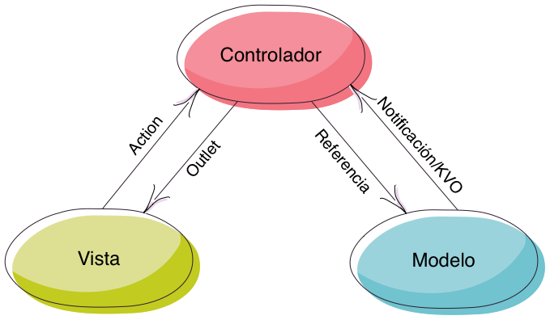

# Introducción a las aplicaciones iOS 

Una vez vistos los conceptos básicos del lenguaje de programación que vamos a usar, que es Swift, vamos a ver qué estructura tienen las aplicaciones en iOS. Como ahora mismo veremos, Apple utiliza mucho los patrones de diseño software en iOS. De hecho todas las *apps* de esta plataforma siguen el conocido patrón Modelo/Vista/Controlador. Por ello veremos primero en qué consiste, cómo se implementa en iOS y qué clases básicas forman la estructura de toda aplicación. Implementaremos nuestra primera aplicación iOS para poder entender mejor todos estos conceptos.

## Patrón general para una aplicación iOS: MVC 

Como acabamos de comentar, las aplicaciones iOS siguen el archiconocido patrón de diseño "Modelo/Vista/Controlador", abreviado comúnmente como MVC. Aunque hay muchas variantes de este patrón y los detalles varían mucho entre ellas, en general en todas:

- El **modelo** es el "corazón" de la aplicación y la parte *que no se ve*, es decir, la estructura de clases que modelan la llamada *lógica de negocio*. Una de las ideas básicas de MVC es que el modelo debería ser independiente de la interfaz (la vista) y por tanto **reutilizable** aunque cambie la interfaz de la aplicación. En general, los *frameworks* de desarrollo de aplicaciones MVC  es en lo que menos suelen intervenir, e iOS no es una excepción. Es decir, el modelo estará constituido generalmente por clases propias, y no necesariamente de ninguna biblioteca del sistema.
- La **vista** es la interfaz de la aplicación. Generalmente todas las plataformas de desarrollo para móviles tienen una biblioteca de componentes de interfaz de usuario: botones, campos de texto, *sliders*, ... que podemos usar para componer la vista. Como veremos, en iOS podemos crear la interfaz "arrastrando" componentes en un editor gráfico integrado en Xcode. O también podemos crear la interfaz por código.
- El **controlador** es el elemento que presenta más diferencias de una variante a otra de MVC. responde a eventos (generalmente acciones del usuario - por ejemplo un *tap* sobre un botón) y realiza peticiones al modelo. Al contrario, también puede detectar un cambio en el modelo y solicitarle a la vista que lo muestre. Como veremos, en iOS el controlador es una clase que hereda de una propia del sistema.

Aunque en MVC el papel de estos elementos está más o menos claro en términos generales, no suele estar tan clara la relación entre ellos (quién comunica con quién y cómo). En la variante concreta de MVC que se usa en iOS, la relación entre estos tres elementos se muestra en la siguiente figura:



Como vemos, el controlador está "enmedio" de la vista y el modelo, aislando ambos entre sí, de modo que vista y modelo no tienen comunicación directa. Esto nos permite modificar uno sin afectar al otro.

En cuanto a la comunicación entre vista y controlador:

- Cuando la vista genera un evento, el controlador lo recibe a través de lo que en iOS se llama un *action*. Básicamente es un método del controlador que hace de *callback* del evento.
- El controlador guarda referencias a los elementos de la vista que nos interesa en lo que se denominan *outlets*. Así puede cambiar la vista (por ejemplo cambiar el texto de un campo o desactivar un botón)

Y entre modelo y controlador:

- El controlador guarda una referencia al modelo y a través de ella puede llamar a sus métodos.
- Cuando se produce un cambio en el modelo, este "avisa" al controlador mediante métodos estándar en iOS para comunicación entre objetos, como son el KVO y las notificaciones locales.

## Comenzando nuestra primera aplicación iOS 

Vamos a implementar una aplicación muy sencilla a la que llamaremos "UAdivino". Es una versión del clásico juguete "[la bola 8 mágica](https://es.wikipedia.org/wiki/Magic_8-Ball)", a la que se le formula una pregunta y que supuestamente responde, dando en realidad respuestas genéricas: "sí", "¡claro que no!", "es muy posible",...

Para crear la aplicación arrancamos Xcode:

 - En las opciones de la izquierda seleccionamos "Create a new Xcode project". 
 - En el siguiente paso elegimos la plantilla "Single View App", ya que nuestra aplicación tiene una única "pantalla". 
 - Tras darle a `Next`, escribimos el nombre del proyecto, `UAdivino`. Hay que asegurarse que en el desplegable de `User Interface` se selecciona `Storyboard`

> SwiftUI, la otra opción de la interfaz, es un *framework* introducido por Apple en junio de 2019 como alternativa a la estructura clásica de las aplicaciones iOS. De momento no la usaremos en el curso. 

 - En la última pantalla del asistente podemos seleccionar la carpeta donde guardar el proyecto. Elegimos la que queramos.

## Estructura del código de una aplicación 

La siguiente figura, tomada de la "[App programming guide for iOS](https://developer.apple.com/library/content/documentation/iPhone/Conceptual/iPhoneOSProgrammingGuide)" de Apple, muestra los elementos básicos de cualquier aplicación iOS. Podemos distinguir la parte del modelo, la del controlador y la de la vista. Nótese que no hay un único controlador ni una única vista. En general, podríamos decir que por cada "pantalla" de nuestra aplicación tendremos un controlador "principal" que controla una vista. Esa vista a su vez está formada por una jerarquía de *subvistas* (paneles, botones, *sliders*,...). Esto no hay que tomarlo literalmente, ya que en una "pantalla" puede haber más de un controlador, pero es útil para hacerse una idea aproximada.


## La plantilla creada por Xcode 

Para no tener que partir de cero, Xcode nos ha creado una plantilla con varias clases y archivos adicionales, que se corresponden con la estructura genérica de una aplicación que acabamos de ver:


- Clases:
    - `AppDelegate`: es la clase que gestiona lo que hacer ante los diferentes eventos del ciclo de vida de la aplicación: cuando acaba de arrancar, cuando va a pasar a segundo plano, ...
    - `ViewController` es el controlador "inicial" de la aplicación, el que "entra en acción" cuando esta arranca. En nuestro caso además es el único controlador ya que nuestra aplicación solo tiene una pantalla.

- Archivos de interfaz de usuario: los `.storyboard`, que constituyen el interfaz gráfico de la aplicación
    + `Main.storyboard`: el interfaz en sí de la *app*, que luego editaremos
    + `LaunchScreen.storyboard`: la pantalla que aparece mientras la aplicación se está cargando
    
- Archivos de configuración
    + `info.plist`: propiedades de configuración de la aplicación, en un formato especial denominado *plist* que ya veremos con detalle en la asignatura de persistencia de datos. Por ahora nos basta con saber que es una lista de nombres y valores de propiedades y que los valores pueden ser numéricos, cadenas o listas.
    
- Recursos: la carpeta `Assets.xcassets`, que es donde se colocan las imágenes y otros recursos de la aplicación

## Creación de la interfaz (la vista) 

La interfaz de la aplicación va a tener el siguiente aspecto, con un "cartel" explicando qué hace la *app*, un botón para solicitar la respuesta, y un campo en el que aparecerá dicha respuesta.


Como hemos comentado, la interfaz está definida en el archivo **`Main.storyboard`. Ábrelo** y verás que en el centro aparece una pantalla de iPhone vacía. La flecha que le apunta desde la izquierda indica que es la pantalla inicial de la *app*. En la parte superior derecha de la barra de botones de Xcode verás un botón con un cuadrado dentro de un círculo (el primer botón de esta zona). Al pulsar en él se mostrará una ventana flotante con los componentes de interfaz de usuario.

> Nota: En versiones anteriores de Xcode (<=9), dicho panel era accesible en la parte inferior derecha de la ventana, sin necesidad de pulsar ningún botón.

Primero vamos a hacer el "cartel" con el mensaje  de "Formula una pregunta en voz alta y UAdivino te dará la respuesta". En iOS este tipo de componente es un **`Label`. Búscalo en el panel de componentes y arrástralo a la pantalla** que estamos diseñando. Una vez colocada puedes hacer las operaciones habituales: moverla con el ratón, cambiar su tamaño arrastrando los puntos de las esquinas o editar el contenido con doble clic. **Cambia el texto del `Label`** por un mensaje como "Formula una pregunta en voz alta y UAdivino te dará la respuesta"

Las propiedades de cualquier componente también se pueden cambiar en el panel de la derecha estando seleccionado el componente. Este panel está dividido en varias secciones, por las que se navega con los iconos de la parte superior. La que más nos interesa por el momento es la cuarta, denominada "property inspector". **Cambia el número de líneas a 2** para que el texto quepa en la pantalla. Cambia también la alineación del texto a centrado para que quede mejor. 


**Arrastra los dos componentes** que faltan: un botón (`Button`) y otro `Label` que debes dejar con el texto vacío y donde aparecerá el mensaje del adivino.

## Implementación del modelo 

En esta *app* el modelo lo único que debe hacer es generar respuestas al azar a demanda. Lo podemos implementar en una clase `Adivino` que tenga un método `obtenerRespuesta`

Para colocar el código de la clase debemos crear un archivo Swift: en Xcode, `File > New > File...` y en el asistente seleccionamos la plantilla "Swift File". Lo guardamos en la misma carpeta `UAdivino`

```swift
import Foundation

class Adivino {
    func obtenerRespuesta() -> String {
        let respuestas = ["Si", "No", "Ni de casualidad", "¡Por supuesto!"]
        let indice = Int(arc4random_uniform(UInt32(respuestas.count)))
        return respuestas[indice]
    }
}
```

Podemos comprobar provisionalmente que el modelo funciona instanciando un `Adivino` cuando la *app* arranque y generando varias respuestas. Algo como:

```swift
let adivino = Adivino()
for _ in 1..5 {
    print(obtenerRespuesta())
}
```

Podemos **insertar el código anterior en la clase `AppDelegate`, dentro del primero de sus métodos**: `application(_ application:, didFinishLaunchingWithOptions:)`, que es el que se ejecuta al terminar de arrancar la aplicación. 

Para **ejecutar el proyecto** pulsa al botón con el símbolo de "Play" de la barra superior de Xcode, o bien selecciona la opción de menú `Build > Run`. Aparecerá el simulador de iOS con la pantalla del iPhone, y en la consola de Xcode deberían aparecer los mensajes generados por el "adivino". 

## Implementación del controlador 

En el controlador es donde vamos a hacer la comunicación entre la vista y el modelo.

- Cada vez que se pulse el botón, el modelo debe generar una respuesta
- Esta respuesta se debe mostrar como texto del `Label` que ahora tenemos provisionalmente vacío.

### Recibir eventos de la vista 

Para recibir eventos de la vista, necesitamos crear un *action*. Esto es lo que en otros entornos de programación se conoce como *listener*, *event handler*, *callback*,... Es simplemente un método del *controller* al que el sistema llama cuando se produce un determinado evento sobre un componente de la interfaz.

Para **crear un *action* que vincule el botón y el controlador** hay que seguir estos pasos en Xcode:

1. Tener abierto el *storyboard* con la pantalla donde está el componente a vincular (en nuestro caso el botón)
2. Pasar a editar en modo *asistente*, en el que se ve tanto la interfaz como el código. En la esquina superior derecha hay dos grupos de tres botones. El primer grupo cambia el modo de edición. Nos interesa el segundo de los botones, con un icono de "aros entrelazados". Al pulsarlo, el editor se dividirá para mostrar no solo la interfaz sino también el código fuente del controller asociado.
3. En el código fuente del `ViewController` buscamos un "hueco" donde se pueda crear un método que será el llamado cuando se genere el evento.
3. Finalmente, para vincular, hacer clic con el ratón sobre el `Button` pero manteniendo pulsada también la tecla `Ctrl`. Sin soltar el ratón, "conectamos" con el código fuente del controller al punto del código del `ViewController`que hemos decidido antes.
4. Al soltar el botón del ratón nos dará a elegir el tipo de conexión (`Connection`). Seleccionamos `Action`, escribimos el nombre que tendrá el método (por ejemplo `botonPulsado`) y pulsamos el botón `Connect`.

Nótese que el método que se ha creado lleva una anotación especial, `@IBAction` que indica que es un *action*. Además a la izquierda del nombre sale un círculo "relleno" que indica que está conectado a un componente de la interfaz. Si pasamos el ratón por encima aparecerá destacado el componente en fondo azul. 

### Llamar al modelo 

Ahora en el método del *action* `botonPulsado` tenemos que llamar al modelo. En nuestro caso es tan simple como llamar a `obtenerRespuesta()` pero para eso necesitamos declarar una instancia del modelo en el controlador. Por ello le añadimos una nueva propiedad:

```swift
//En el ViewController.swift

class ViewController: UIViewController {

   let miAdivino = Adivino()

   ...
```

Ahora tenemos que obtener una respuesta cuando se pulse el botón:

```swift
@IBAction func botonPulsado(_ sender: AnyObject) {
        let respuesta = self.miAdivino.obtenerRespuesta()
}
```

pero todavía nos falta mostrarla en la interfaz. Para eso necesitamos conectar el *controller* con la vista

### Modificar la vista 

Por cada componente de la interfaz de usuario que queramos modificar desde el *controller* necesitamos definir un *outlet*, que no es más que una variable que referencia al componente. Pero la variable no la declaramos nosotros sino que se crea de forma parecida a como se crean los *action*: gráficamente, con el ratón.

Queremos conectar el *controller* con el `Label` que por ahora tiene texto vacío:

1. De nuevo ponemos el editor en modo asistente, y buscamos un "hueco" apropiado en el código fuente del *controller* donde se pueda definir la variable.
2. Arrastramos con `Ctrl` + clic desde el botón al código del *controller* pero ahora cuando soltemos el botón del ratón y nos pregunte el tipo de conexión dejamos `Outlet`. Escribimos un nombre apropiado para la variable (por ejemplo `labelRespuesta`) y pulsamos sobre `Connect`.

Vemos que la variable recién creada es del tipo `UILabel` y lleva la anotación `@IBOutlet` para indicar que es un *outlet*. Si miramos la documentación de iOS veremos que a través de la propiedad `text` tenemos acceso al texto del componente. Por lo que finalmente el método del *action* que hemos hecho antes quedará:

```swift
@IBAction func botonPulsado(_ sender: AnyObject) {
    let respuesta = self.miAdivino.obtenerRespuesta()
    self.labelRespuesta.text = respuesta
}
```

Ya debería funcionar todo correctamente, así que ya podemos probar la *app*.