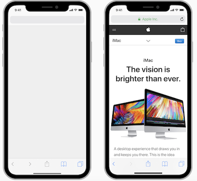

# Recursos en aplicaciones iOS

Una *app* es más que código, normalmente incluirá el propio icono de la *app*, iconos adicionales para botones/*tab bars*, imágenes, audios, videos o incluso texturas, *stickers* u otros muchos elementos dependiendo del tipo de *app*. Todos estos elementos reciben el nombre genérico de *recursos*.

En el proyecto de Xcode podemos ver una carpeta llamada `Assets.xcassets` que es el *asset catalog* de la app. Sirve para almacenar los recursos que necesitemos usar en la app.

En la documentación de Apple podemos consultar el [uso del editor del *asset catalog*](https://help.apple.com/xcode/mac/8.0/#/dev10510b1f7), aquí de momento nos vamos a limitar a ver cómo añadir un icono para la *app* y una serie de imágenes.

## Resoluciones en dispositivos iOS

Antes de ver cómo añadir imágenes o iconos necesitamos discutir un poco el tema de la resolución. El "parque" de dispositivos iOS en funcionamiento tiene resoluciones de pantalla muy distintas entre sí, bien por la diferencia de antigüedad o bien por tener la pantalla de un tamaño muy distinto. En dispositivos más o menos actuales van desde los 640x1136 del iPhone SE hasta los 2048x2732 pixeles del iPad Pro de 12.9 pulgadas (podéis consultarlo por ejemplo en [iOS Resolution](https://www.ios-resolution.com/)).

Si nuestra aplicación usa imágenes es normal que las que en un dispositivo de resolución "baja" se ven bien se vean demasiado pequeñas en uno de "alta" o bien que si iOS las escala para que ocupen el mismo porcentaje de pantalla se vean pixeladas en dispositivos de alta resolución. Por eso deberíamos añadir cada imagen que use nuestra app a distintas resoluciones.

Para simplificar el desarrollo, en iOS se consideran solo 3 resoluciones distintas, llamadas en la documentación `@1x`, `@2x` y `@3x`. Como su propio nombre indica las dos últimas son múltiplos de la primera. Es decir que si tenemos una imagen de 100x100 pixeles como base, deberíamos tener la misma a 200x200 para `@2x` y 300x300 para `@3x`. 

> Evidentemente no se trata de que cojamos la misma imagen de 100x100 y la escalemos al doble o triple, ya que se verían pixeladas, sino al contrario, que partamos de una imagen en alta resolución y vayamos generando versiones más pequeñas de la misma.

En las ["Human Interface Guidelines"](https://developer.apple.com/design/human-interface-guidelines/) de Apple tenemos más información sobre la resolución de [imágenes](https://developer.apple.com/design/human-interface-guidelines/images) en *apps* de iOS, además de consejos de diseño y usabilidad.

> En el mercado ya no quedan prácticamente dispositivos de resolución `@1x` y de hecho no la necesitaremos salvo que queramos hacer compatible nuestra app con iOS9 o inferior.

## Icono de la aplicación

En el *asset catalog* hay un elemento denominado `appIcon` donde colocar el icono de la aplicación. Debido a la diferente resolución de los dispositivos iOS, como ya hemos visto, los iconos vienen en distintos tamaños, desde 120x120 para los iPhone a @2x hasta 180x180 a @3x.  Otros tamaños adicionales se usan cuando nuestra *app* sale en los resultados de *Spotlight* (la búsqueda integrada en el dispositivo), si tiene su propio apartado de ajustes en los ajustes del sistema, cuando aparece en las notificaciones, etc. En total en la actualidad pueden hacer falta hasta 9 tamaños distintos de iconos.

Afortunadamente desde la versión 14 de Xcode no es necesario que creemos nosotros todos los tamaños. Los proyectos están por defecto en modo "Single size", lo que quiere decir que si colocamos un icono a 1024x1024 Xcode generará todos los tamaños automáticamente. Si queremos crear los distintos tamaños de manera manual, en la parte derecha de la pantalla seleccionaríamos el modo "All sizes". En modo manual, si no disponemos de alguno de los tamaños Xcode lo generará escalando los que haya. 


> Si tenemos un Xcode<14, o queremos desplegar en iOS<12 no podremos usar la opcíon de "Single size". Hay páginas web como [https://appicon.co/](https://appicon.co/) que pueden generar automáticamente todos los tamaños a partir de un icono dado.

Si seleccionamos el `appIcon` veremos una plantilla donde "dejar caer" el icono 1024x1024 (en modo "Single size" o los iconos de cada tamaño necesario (en modo "All sizes"). Hay que tener en cuenta que deben estar en formato PNG sin transparencia. Para más información consultad el [apartado correspondiente](https://developer.apple.com/design/human-interface-guidelines/app-icons#Specifications) de las Human Interface Guidelines.


## Imágenes

Como cada imagen debería estar al menos en tamaño `@2x` y `@3x`, al añadir una imagen a los recursos en realidad estamos añadiendo un conjunto de imágenes o *image set*. Para crear un *image set* se puede pulsar el botón de `+` que aparece en la esquina inferior izquierda del editor del *asset catalog* y seleccionar `New Image set`. Por defecto se llamará simplemente `Image` pero podemos cambiarlo de nombre haciendo doble clic sobre el nombre actual.

En el código de la *app* podemos usar el nombre dado en el *asset catalog* para cargar la imagen:

```swift
let imagenLibro = UIImage(named:"libro")
```

> **"Truco"**: si las imágenes tienen un nombre que acaba en `@2x` o `@3x` (algo como `libro@2x.png`), xCode las usará automáticamente para la resolución deseada. Xcode tomará la de `@1x` simplemente como la que no tenga nada especial en el nombre. En el Finder (el *administrador de archivos*) podemos seleccionar entonces tres imágenes juntas (haciendo clic +  Cmd para que al seleccionar una no se pierda la anterior) y "dejarlas caer" juntas en el image set para que cada una se coloque en su hueco.

## Launch screen

Es una pantalla que iOS mostrará al inicio de la carga de la *app*. En otros sistemas como Android o el mismo MacOS muchas aplicaciones tienen una *splash screen*, que aparece al comienzo con un logo, una imagen, los créditos de la *app*, etc. Sin embargo [según las Human Interface Guidelines](hthttps://developer.apple.com/design/human-interface-guidelines/launching#Launch-screens) de Apple una *launch screen* no es nada de eso, sino que debe ser *lo más parecida posible a la primera pantalla de la app* . De este modo se le dará la impresión al usuario de que la aplicación se carga rápidamente. 

Es decir, la *launch screen* es una especie de versión "estática" o "de cartón piedra" (😉) de la primera pantalla de la *app*. Evidentemente si la *app* muestra contenido dinámico este contenido no puede formar parte de la *launch screen* pero sí podemos por ejemplo colocar ciertos elementos estáticos como botones, cuadros de búsqueda, *tab bars*, etc, como puede verse en este ejemplo incluido en la documentación de Apple:



En xCode la *launch screen* se diseña como una pantalla más de la aplicación, en el `LaunchScreen.storyboard`, arrastrando componentes de interfaz como en cualquier otra pantalla, aunque los elementos que se incluyan no van a ser interactivos. No se recomienda incluir textos ya que no van a poder adaptarse al idioma del dispositivo.

