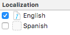

# Internacionalización de aplicaciones iOS

En un mercado global hay que tener previsto desde el principio la adaptación de los mensajes y textos mostrados por la *app* al idioma local, y también de otras convenciones (unidades de medida, formatos de números y fechas,...). Al proceso de preparación de la *app* para soportar distintos idiomas se le denomina *internacionalización* (o i18n, por el número de letras existentes entre la "i" inicial y la "n" final de la palabra completa). A la adaptación para un idioma concreto se la denomina *localización*. 

Vamos a ver aquí una introducción a las funcionalidades básicas que nos da la plataforma iOS para internacionalizar y localizar nuestras aplicaciones.

## Configurar el soporte para los idiomas deseados

En la versión actual de Xcode **los proyectos ya incluyen por defecto soporte para i18n**. Lo que tenemos que hacer es añadir los idiomas para los que queramos localizar la *app*.

> Como veremos, este paso es conveniente hacerlo una vez hayamos terminado el diseño de la interfaz, ya que los componentes de UI que añadamos después no estarán localizados por defecto y tendremos que hacerlo manualmente

En el *Project Navigator* de la izquierda de la pantalla debemos seleccionar el icono del proyecto. Una vez hecho esto, en la parte central hay que asegurarse de seleccionar el "project" y no el "target". En el apartado `Info`, al final de las propiedades veremos un apartado llamado `Localizations`.


El idioma de desarrollo o *development language* es el que se va a usar por defecto para desarrollar la interfaz. Además de este podemos añadir otros idiomas. En la versión actual de Xcode solo está previsto el inglés como *development language* y no se puede cambiar desde el IDE (solo podríamos cambiarlo [editando manualmente el archivo `.pbxproj`](https://developer.apple.com/forums/thread/26130) del proyecto).

Para añadir un idioma basta pulsar `+`


Fíjate en que cuando añadimos un idioma aparece un cuadro de diálogo que nos dice qué *storyboards* se van a internacionalizar, lo habitual será seleccionarlos todos pero podemos escoger los que nos interesen. Además podemos elegir el método usado. Por defecto es `Localizable strings`, pero hay otro método llamado  `Interface builder storyboard`:

- `Localizable strings`: por cada idioma hay un archivo de texto `Strings` en el que se almacena la traducción de los textos de cada botón, label, etc. El *storyboard* es único para todos los idiomas, y lo que se hace es cambiar solamente el texto.
- `Interface builder storyboard`: tenemos una copia del *storyboard* por cada idioma, y la editamos por separado.

Aquí vamos a describir cómo usar los `Localizable strings`, ya que es el método más común.

## Localizar los *storyboards*

### Los archivos `.strings`

Si hemos añadido idiomas adicionales veremos que en el *project navigator* los iconos de *storyboard* aparecen con una flecha a la izquierda indicando que en realidad son varios archivos. Al desplegarlo veremos que es el *storyboard* en sí más un archivo `.strings` por cada idioma añadido.


Al abrir este archivo `.strings` veremos que es un archivo de texto en el que por cada componente de usuario que contenga texto hay una línea en el formato

```swift
"identificador-del-componente" = "Texto mostrado" 
```

Lo único que tenemos que hacer es *cambiar el texto al idioma correspondiente*. El identificador del componente es un tanto críptico ya que es autogenerado por Xcode,y se corresponde con el `Object Id` que podemos ver en el `Identity inspector`, aunque casi siempre es fácil saber de qué componente se trata simplemente por el texto mostrado.

### Probar la interfaz

Podemos previsualizar cómo quedará la interfaz en los distintos idiomas sin necesidad de ejecutar la *app*. En el editor del *storyboard* clicamos sobre el botón  de la barra superior y seleccionamos la opción `Preview`. Se mostrará el *storyboard* en el idioma base. Este idioma aparecerá en la esquina inferior derecha, pulsando sobre él podemos cambiarlo.

También podemos probar la *app* en el simulador y cambiar aquí el idioma del sistema. Habrá que salir de la *app*, ir al icono de *settings* (o *configuración* en la versión en español) y en el apartado `General` cambiar el `Language & Region`. El proceso es un poco más tedioso que la simple previsualización porque hay que salir y volver a entrar en la *app* y además el simulador tarda unos segundos en aplicar el nuevo idioma.

### Añadir elementos a la interfaz tras internacionalizar

Hay un problema con el proceso descrito en los apartados anteriores y es que cuando se añaden nuevos elementos a la interfaz de usuario, **Xcode no actualiza automáticamente los archivos `.Strings`**. 

Una posible solución sería editar manualmente los `.Strings` pero es un proceso tedioso porque, como hemos visto, cada componente viene identificado con su `Object id` y tendríamos que consultarlo manualmente en Xcode y copiarlo al archivo de texto, repitiendo la operación para cada nuevo elemento de la interfaz.

Apple tiene algunas herramientas que permiten automatizar el proceso en cierta medida, pero son herramientas en línea de comandos y su uso no es precisamente trivial. Por ejemplo podríamos usar la herramienta `ibtool`. Supongamos que hemos añadido una etiqueta al `Main.storyboard` y queremos actualizar el `Main.Strings` de español. Tendríamos que abrir una terminal e ir hasta el directorio donde esté este archivo. La estructura de de directorios y archivos relativa a la internacionalización será como la siguiente:


Como vemos, los archivos de español están en un subdirectorio llamado `es.lproj`. En el ejemplo solo hay un `Main.Strings` porque la *launchscreen* está vacía y por eso no ha generado ningún archivo. Los archivos del idioma base están en `base.lproj`,  y este es el que contiene los *storyboards*.

Con la opción `--import-strings-file` le decimos a `ibtool` cuál es la versión actual del `.Strings` de la que queremos partir, y con `--generate-strings-file` en qué archivo queremos generar el resultado. Finalmente ponemos el nombre del archivo con el *storyboard*. Por ejemplo, suponiendo que abrimos la terminal y nos movemos al directorio `es.lproj`, el comando sería algo como:

```bash
ibtool --generate-strings-file Main.Strings --import-strings-file Main.Strings ../Base.lproj/Main.storyboard
```

Ponemos el mismo valor para el `--generate-strings-file` que para el `--import-strings-file` para actualizar el archivo, no queremos generar uno nuevo.

Una vez hecho esto, ya podemos editar manualmente el `.Strings` para añadir las traducciones de los nuevos elementos de la interfaz.

> Hay herramientas de terceros que automatizan bastante más el proceso, algunas comerciales y otras *open source* como por ejemplo [BartyCrouch](https://github.com/Flinesoft/BartyCrouch). Esta sigue siendo una herramienta de línea de comandos pero con comandos mucho más sencillos, Por ejemplo podemos ejecutar simplemente `bartycrouch -p trayectoria/hasta/el/proyecto` para actualizar automáticamente *todos* los archivos `Strings`. 

## Localizar los mensajes en el código

Hay mensajes que no están fijos en la interfaz, sino que se generan desde el código. Por ejemplo recordemos la *app* `UAdivino` que hicimos en el tema de "Introducción a las aplicaciones iOS".

Lo que tenemos que hacer para internacionalizar este tipo de mensajes es usar *localized strings*. Este tipo de *strings* no se toman de manera literal sino *que se consideran claves en un archivo `.Strings`*. El sistema sustituirá la clave por el valor asociado en el idioma actual.

La representación interna de los mensajes en el código sería parecida, aunque puede ser más breve, ya que no es el mensaje que va a ser el usuario final.

```swift
import Foundation

class Adivino {
    func obtenerRespuesta() -> String {
        let respuestas = ["si", "no", "ni_casualidad", "claro"]
        let indice = Int(arc4random_uniform(UInt32(respuestas.count)))
        return respuestas[indice]
    }
}
```


En el momento en que queremos asignar el mensaje a un elemento de usuario podemos usar la *macro* `NSLocalizedString`, que obtiene el mensaje asociado a la clave

```swift
@IBAction func botonPulsado(_ sender: AnyObject) {
    let respuesta = self.miAdivino.obtenerRespuesta()
    self.labelRespuesta.text = NSLocalizedString(respuesta, comment: "")
}
```

El segundo parámetro de `NSLocalizedString` es un comentario que pueda ayudar a un traductor de la *app* a entender el contexto del mensaje. En este caso no tiene sentido y lo dejamos vacío.

Para que esto funcione nos falta todavía crear el archivo `.strings`. Por defecto se debe llamar `Localizable.strings`. Para crearlo, en Xcode se elige `File > New > File`. De entre las plantillas disponibles hay que ir a la sección `Resource` y elegir allí `Strings File`.

Teniendo seleccionado el archivo, en el `File inspector` del panel de la derecha de Xcode pulsamos el botón `Localize...` para que tenga versiones en distintos idiomas.


Nos preguntará qué versión inicial queremos crear (por defecto `English`). 


Una vez creada esta podemos marcar el resto de idiomas que hemos añadido a nuestra *app* (en nuestro caso solo español)



Esto habrá creado dos archivos distintos para `Localizable.strings`, uno para inglés y otro para español. Ahora solo tenemos que editar las claves y los valores de cada uno de ellos.

Para la versión inglesa sería algo como:

```swift
"si" = "Yes!";
"no" = "No!";
"ni_casualidad" = "No way!";
"claro" = "Sure!";
```

Y para la española:

```swift
"si" = "¡Si!";
"no" = "¡No!";
"ni_casualidad" = "¡Ni de casualidad!";
"claro" = "¡Claro que sí!";
```

Para probar esta funcionalidad tendremos que ejecutar la *app* en el simulador y cambiar el idioma desde la aplicación de *settings/configuración*.

Es posible que en algunos casos tengamos mensajes con una parte fija y una variable. Por ejemplo un saludo en el que queremos incluir el nombre del usuario. Por desgracia, en la versión actual de iOS la interpolación de cadenas de Swift todavía no funciona para los mensajes internacionalizados. Tenemos que usar *placeholders* en el mensaje, que son caracteres que funcionan de modo similar a como lo hacen los caracteres de formato en el `printf` de C:

```swift
/* .strings en versión inglés */
saludo = "Welcome %@";
...
```

En este caso, para "montar" el mensaje final tenemos que usar un inicializador de `String` que acepte cadenas de formato:

```
let nombre = "John"
let mensaje = String(format: NSLocalizedString("saludo", comment: ""), nombre)
```

> Nótese que estos *placeholders* (`%@`) vienen "heredados" del lenguaje Objective-C, que utiliza [unos caracteres de formato similares a los de C](https://developer.apple.com/library/content/documentation/Cocoa/Conceptual/Strings/Articles/formatSpecifiers.html). Por ejemplo para mostrar un número entero se usa `%d`, aunque para mostrar una cadena se usa el carácter de formato genérico de "objeto", que como se ha visto es `%@`.