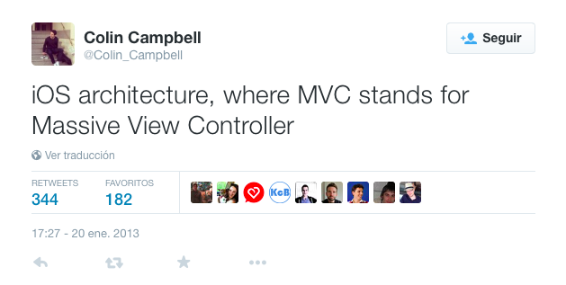
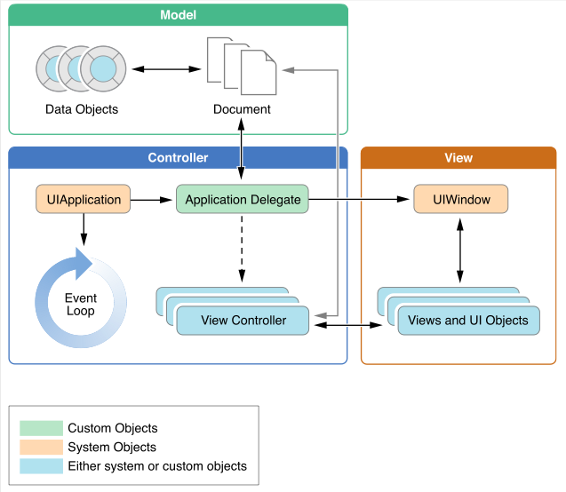

## Master en Desarrollo de Software para Dispositivos móviles
## Sesión 2: Introducción a las aplicaciones iOS

---

## Puntos a tratar

- MVC en iOS
- Estructura de una aplicación

---

## Modelo/Vista/Controlador

Patrón de diseño arquitectónico que separa el **modelo del dominio** de su **representación en la interfaz**

 <!-- .element class="stretch" -->

---

## Algunas variantes

[http://kasparov.skife.org/blog/src/java/mvc.html](http://kasparov.skife.org/blog/src/java/mvc.html) <!-- .element class="fig_caption" -->

---

##Modelo/Vista/Controlador en iOS

 <!-- .element: class="stretch" -->

---

##El modelo

  - El núcleo de la aplicación, los objetos que modelan la **lógica de negocio**
  - Son clases creadas por nosotros, no heredan de ninguna librería de iOS
  - No debería contener referencias al controlador ni a la vista. Esto permite que sea **reutilizable** aunque cambie la interfaz de la aplicación
  - Comunica con el controlador con *notificaciones* o *KVO* (eventos)
  

---

## La vista

- Normalmente se crea de manera gráfica, con el `interface builder` de Xcode
- Usa clases del sistema: `Button`, `Label`,... (o heredan de estas para personalización)

---

## El controlador

- El "pegamento" entre vista y modelo
- Contiene referencias a vista y modelo

---

---

##Estructura de una aplicación iOS

 
<!-- .element: class="stretch" -->

